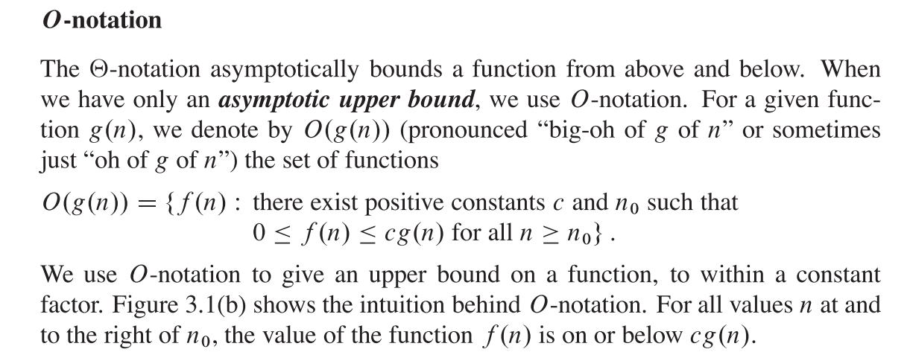
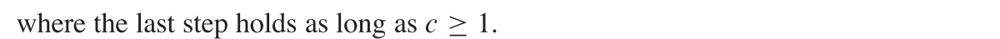

# 算法分析
内容主要来源于《Introduction to Algorithms Third Edition》（算法导论）第2-4章，涉及算法时间复杂度分析、表示法、分治与递归、几种解递归算法时间复杂度的方法——substitution method（代入法）、recurtion-tree method（递归树法）、master method（主方法）。本文预估阅读时间超过2小时，数学推导较多，谨慎阅读。

[toc]

## 算法分析与运行时间
算法分析的主要目的是预测运行一个算法所需要的资源。这种资源可以是内存、贷款等，但通常来说最关心的资源是运算时间。本书中使用的算法分析模型是RAM模型，认为算法会以指令方式一个一个执行，不存在并发操作。算法的运行时间（running time），是一个关于输入大小（input size）的函数。Input size虽然经常被认为为数组大小，在某些算法中也可以是比特数（两个整数相乘，以整数位数为输入大小）、结点与边的数量（图）。Running time与运行的原始操作相关，通常假定运行某一行$ i $需要时间$ c_{i} $，这里的$ c_{i} $是一个常数。

作者在讲解running time计算的时候用了一个insertation sort（插入排序）的例子，详见P26。

对于不同的输入，可能会有不同的算法运行时间，对于插入排序而言，若数列是已经排序的（升序），运行时间为n的线性函数，若数列是逆向排序的（降序），运行时间为n的二次函数。从而便有了最好、最坏、平均运行时间。其中最好运行时间（best-case running time），是运行的下界，同理最坏运行时间（worst-case running time）是上界。本书一般来说专注于寻找最坏运行时间。平均运行时间涉及到本书的概率分析部分，通常假定所有input size出现的概率是相同的。在实际中可能并非如此，这里涉及到本书的randomized algorithm部分。

在计算运行时间的时候，我们可能会得到类似于$ an_{}^2 + bn + c$之类的式子，这里的$n$代表输入大小，$a$、$b$、$c$代表取决于$c_{i}$的常数。我们在表示运算时间的时候，相比于这种式子，更喜欢使用另外一种简化的版本（原文是simplifying abstraction）：增长率（rate of growth）或者增长极（order of growth），只关注最高次项而忽略对最终结果影响较小的低次项与常数。因此，这个运行时间被写作为$\Theta(n_{}^2)$，读作为theta of n-squared。这里用了theta表示法（theta notation），它是一种渐进表示法（asymptotic notation），后面的部分会介绍其他类型的表示方法与它们之间的区别。

## 渐进表示法与$\Theta$表示法、$O$表示法、$\Omega$表示法
渐进表示法：
当input size 足够大的时候，它使得只有order of growth与算法运行时间是高度相关的，我们此时研究的是算法的渐进效应（asymptotic efficiency）。即inpuy size无限增长的时候，算法的运行时间会怎么增长。渐进表示法实际上是一种最高次项而忽略对最终结果影响较小的低次项与常数的表示法。除了表示运行时间，它可以被用作来研究算法的空间使用，而且也可以用于研究多种类型的运行时间（最坏运行时间等）。

$\Theta$表示法、$O$表示法、$\Omega$表示法：
下面这图+下面的注释比较简单地解释了三种表示法，总得来说，$\Theta$表示法给出了运行时间函数的紧界（tight bound）（上界+下界）、$O$表示法给出了上界（upper bound）、$\Omega$表示法给出了下界（lower bound）。

然后下面是三种方法的具体数学定义，最好也看一看。注意，这些表示法表示的是函数集合（a set of functions），这些函数满足特定的条件，数学定义是以集合形式写的。

举个$\Theta$表示法的例子。这里实际说明了$\Theta(n_{}^2)$表示的是夹在$c_{1}n_{}^2$和$c_{2}n_{}^2$之间的一系列函数。

书上还介绍了一个定理：

除此之外，书上还介绍了渐进表示法在等式与不等式中的情况，$o$表示法（大O表示法可能是渐进紧的（asymptitically tight）也可能不是，而小o表示法表示了非渐进紧的上界）、$\omega$表示法等，篇幅有限，不再赘述。

## 递归、分治与递推式
许多实用的算法在结构上是递归（recursive）的，即在解决特定问题的时候，这些算法递归地调用自己去解决相关的子问题。这些算法通常符合一种分治的模式（a divide-and-conquer approach）：将原始问题分解为相似的但输入规模更小的子问题，递归地解决子问题，并将子问题的解合并起来得到原始问题的解。
分治范式（paradigm）通常包括以下三步：

这里举一个归并排序（merge sort）的例子。归并排序采用了分治范式：

描述该算法的伪代码见下。MERGE函数完成的步骤是将两个已经排序的子序列合并为一个排序序列，此处省略这一步完成的具体过程，有问题参见P30-P34。

如果一个算法递归调用自身，我们在描述其运行时间的时候通常采用递推式（recurrence equation）或者递推（recurrence）。符合分治范式的递推式常见格式为:

这个递推式描述的是，在input size(n)小于等于某一个常数c的时候，运行时间$T(n)$为一个常数时间$\Theta(n)$，当input size(n)大于常数c的时候，我们通过分治，将问题分解为a个子问题，每个子问题的input size为原始问题的$1/b$，因为子问题和原始问题是相似的，同样符合$T(n)$的运行时间函数，这a个子问题总共花费的运行时间为$aT(n/b)$，$D(n)$表示的是将问题划分（divide）为子问题花费的运行时间，$C(n)$表示的是将子问题的解合并（combine）为原始问题的解需要花费的运行时间。

对于归并排序的案例，它每个步骤的运行时间和递推式（这里研究的是最坏情况（worst-case），MERGE需要$\Theta(n)$）：

其实这个式子有点像高中数列里面的递推公式，我们想得到$T(n)$的函数表达式，实际上就是想求数列的通项公式，下面的部分将介绍几种求解方法。

## 求解递推式的几种方法
书上主要介绍了三种方法——substitution method（代入法）、recurtion-tree method（递归树法）、master method（主方法）。三种方法的简要描述如下：

下面详细介绍一下各种方法的具体使用：
1. substitution method（代入法）  

代入法解递推式主要包含两步，第一步是猜测解的形式，第二步是用数学归纳法（mathematical induction）找到相应常数并验证猜测的解：

举一个例子：

代入法之所以叫代入法，是因为图中第一步将子问题对应的猜测解代入到了递推式中，从而将等式转化为了不等式。以上的证明实际上还不算完整，因为数学归纳法中要求对边界条件进行检验（回忆一下高中数学归纳法，经常先验证第一项是否满足）。然而初始项（base case）通常是不满足的:

由于渐进表示法允许我们证明在n大于等于某个$n_{0}$时满足$T(n) \leq cn lgn$即可，这里的$n_{0}$我们可以进行选择以保证初始项符合猜测解。下面这里剔除掉了$T(1)$并以$T(2)$和$T(3)$作为base case，常数项c也发生了改变。

代入法涉及到一些如何猜测解、递推假设是否足够强、换元的运用等问题，由于篇幅限制，此处不再展开，详见P84-87。

1. recurtion-tree method（递归树法）  

在使用代入法的时候，猜测解可能是比较困难的一步。递归树法可以帮助猜测解，但是同时它也可以作为一种直接得出解的方法。递归树法使用树的形式表示递归过程，树的结点（node）表示了每个子问题所需要花费的运行时间，加和层结点得到每一层（level）所需花费的时间并把所有层需要花费的时间加和，可以得到总时间。

前面提到的归并排序的递归树：

到这里你应该大致了解了递归树的形式与求解，如果你有兴趣继续深入了解的话，可以看一下下面这两种相对来说比较不常见的递归树，与它们的求解过程。
第一种是一个三叉树：
它的递推式是

由于向下取整（floors）与向上取整（ceilings）在求解通项公式的时候并没有特别大的影响，我们可以直接把问题看作：

这里需要注意的是，我们在这个问题中把n看是以4为底的指数，这样子问题的规模就是一个整数了，可以简化问题。递归树：

稍微解释一下上图中的(b)，它实际上表示的是分治的divide和combine过程花费了$cn_{}^2$的时间（根节点），然后是三个子问题，每个花费$T(n/4)$时间。具体的求和过程是一个完全的数学过程，实际上是把图(d)中右边列出的每一层的时间求和，求解过程比较繁复，但是我觉得还是有必要在这里粘贴出来，它给出的求解思路与计算非常清晰，如何计算子问题size、层数、每层时间总数、求和并用无穷递减等比级数放缩，值得学习：

这里其实得到了一个猜想解，用代入法可以验证这个猜想：

第二种把一个原始问题分成了不等规模的子问题，会导致到叶子结点路径不等：

求解过程：

但其实这棵递归树不是完全二叉树，所以不是每一层的时间和都为$cn$。以上这种方法有一些小问题，但由于我们只是猜测一个解，对精确度不需要有太高的要求。接下来用代入法验证猜想：

3. master method（主方法）  

主方法其实是基于主定理（Master Theorem）给出解的，我个人认为这是求解较为通用且简便的方法，但主方法存在一定限制。

解释一下主定理。三种情况其实代表了$f(n)$与$n^{\log_ba}$的三种不同的大小关系，第一种情况是$f(n)$小，第二种情况是相等，第三种情况是$n^{\log_ba}$小。

注意，上面的“小”不只是数值上小，而是多项式小于（polynomially smaller），具体解释见下。这会导致主定理不能覆盖所有$f(n)$的情况，某些情况下不可以使用主定理：

下面举几个运用主方法求解的例子：

## 回到原点
我一开始研究这个问题是因为在剑指上看到了一个不太理解的时间复杂度，后面发现其实这跟递归树关系也不怎么大，所以总得来说前面这么多是白看了hhh。这段代码来自剑指P210，我对这个算法是O(n)存疑。

这个算法里面提到的Partition函数第一次出现好像是在快速排序里面，使某一个选出的数字左边都是小于它的，右边都是大于等于它的，选自剑指P80。

为什么说白看了，是因为这根本不是递归树好吧，它都不是调用自己。好的，接下来都是我自己的看法。Partition这个函数选的index有随机性，导致getLeastNumber的时间复杂度有最好和最坏情况，Partition时间复杂度应该是O(n)吧。最好情况是，第一次就随机到了k-1就不执行while里面的东西了，复杂度应该是O(n)。最坏的情况是，我要最小的一个数（k取1），partition随机到的是最小的n、n-1、n-2....个数，复杂度应该是O(n2)吧。