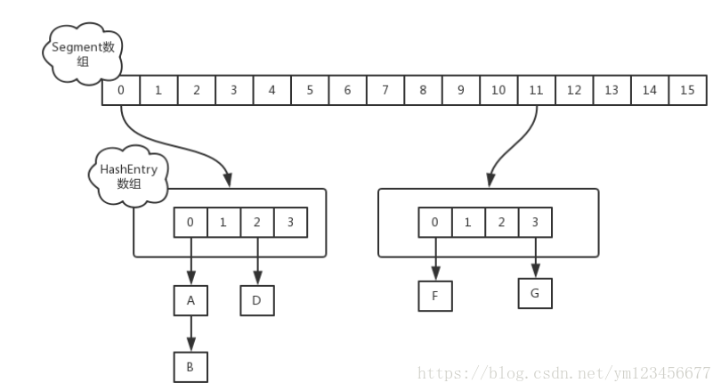
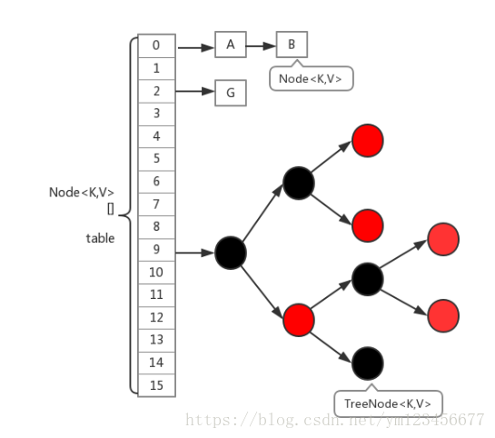

# ConcurrentHashMap
ConcurrentHashMap和Hashmap一样，分为1.8以前和以后两个版本。

## 1.7及之前
HashTable容器在竞争激烈的并发环境下表现出效率低下的原因是所有访问HashTable的线程都必须竞争同一把锁，concurrentHashMap采用了一种锁分段的技术，首先将数据分成一段一段地存储，然后给每一段数据配一把锁，当一个线程占用锁访问其中一个段数据的时候，其他段的数据也能被其他线程访问。详见[Concurrenthashmap的实现原理分析](https://blog.csdn.net/ym123456677/article/details/78860719)

具体的数据结构可以见这张图：

ConcurrentHashMap是由Segment数组结构和HashEntry数组结构组成。Segment是一种可重入锁（ReentrantLock），在ConcurrentHashMap里扮演锁的角色；HashEntry则用于存储键值对数据。一个ConcurrentHashMap里包含一个Segment数组。Segment的结构和HashMap类似，是一种数组和链表结构。一个Segment里包含一个HashEntry数组，每个HashEntry是一个链表结构的元素，每个Segment守护着一个HashEntry数组里的元素，当对HashEntry数组的数据进行修改时，必须首先获得与它对应的Segment锁，如下图所示。

## 1.8
ConcurrentHashMap在1.8中的实现，相比于1.7的版本基本上全部都变掉了。1.8中放弃了Segment臃肿的设计，取而代之的是采用Node + CAS + Synchronized来保证并发安全进行实现。首先，取消了Segment分段锁的数据结构，取而代之的是数组+链表（红黑树）的结构。而对于锁的粒度，调整为对每个数组元素加锁（Node）。然后是定位节点的hash算法被简化了，这样带来的弊端是Hash冲突会加剧。因此在链表节点数量大于8时，会将链表转化为红黑树进行存储。这样一来，查询的时间复杂度就会由原先的O(n)变为O(logN)。下面是其基本结构：

## 两种版本的对比
1.数据结构：取消了Segment分段锁的数据结构，取而代之的是数组+链表+红黑树的结构。
2.保证线程安全机制：JDK1.7采用segment的分段锁机制实现线程安全，其中segment继承自ReentrantLock。JDK1.8采用CAS+Synchronized保证线程安全。
3.锁的粒度：原来是对需要进行数据操作的Segment加锁，现调整为对每个数组元素加锁（Node）。
4.链表转化为红黑树:定位结点的hash算法简化会带来弊端,Hash冲突加剧,因此在链表节点数量大于8时，会将链表转化为红黑树进行存储。5.查询时间复杂度：从原来的遍历链表O(n)，变成遍历红黑树O(logN)。
[详见这里](https://blog.csdn.net/qq_40198004/article/details/89047318)