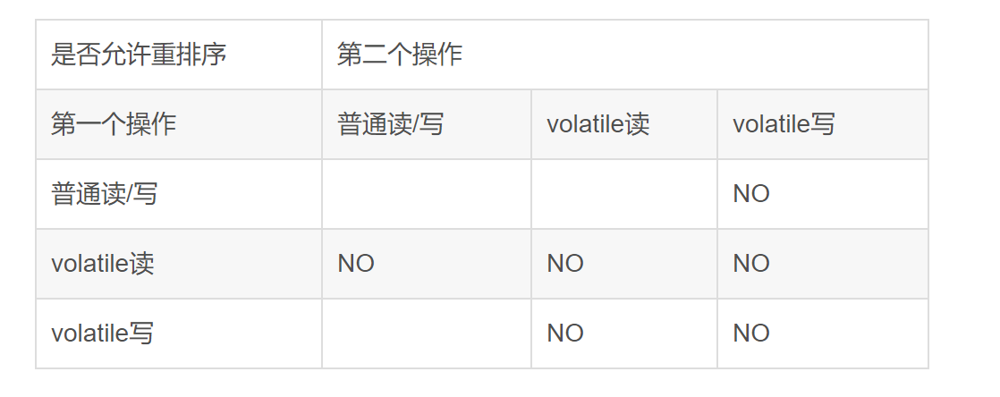

# Volatile
voaltile的内容有点多，单独用一点篇幅来写一下。

## 三层语义(一般说两层语义，指可见性与有序性)
+ 可见性
对一个volatile变量的读，总是能看到任意线程对这个变量的最后写入。相当于
1.将当前处理器缓存行的数据写回到系统内存
2.这个写回内存的操作会使得在其他处理器缓存了该内存地址无效

可见性是由volatile的读/写语义保证的。

这里补充一下，volatile的读/写语义
volatile读的内存语义：读一个内存变量时，JMM会把线程对应的本地内存置为无效，线程接下来需要到主存中读取共享变量。
volatile写的内存语义：写一个内存变量时，JMM会把线程对应的本地内存中的共享变量刷新到主内存。

+ 禁止指令重排序（有序性）
如下表格，是一个volatile与普通变量之间是否允许重排序的说明：


从表格里可以看出来
1. volatile写之前的操作，禁止重排序到volatile之后
2. volatile读之后的操作，禁止重排序到volatile之前
3. volatile写后volatile读，禁止重排序，禁止重排序

禁止指令的重排序，是通过在指令序列中插入内存屏障实现的。
一般来说为了实现以上效果，
1. 要在volatile写前插入storesore屏障，后插入storeload屏障。
2. 在volatile读前插入loadload屏障（也有说不插这一层屏障的），后插入loadstore屏障（艺术里面还插入了loadload屏障）。
编译器可能会根据实际的情况，在不影响内存语义的前提下，省略部分屏障。

为什么要这么做？
volatile写前应加入StoreStore屏障，防止普通共享变量的写入不被更新（普通写只是写入本地内存，volatile写更新到主存）；
volatile写后应加入StoreLoad屏障，防止volatile变量读写顺序出现问题；（使volatile读能读到最新的volatile写更改过的值）
volatile读后应加入LoadLoad屏障，防止普通共享变量读到旧数据；（volatile读会强制去主存中读取到工作内存，普通读只会从工作内存中读取）
volatile读后应加入LoadStore屏障，防止普通共享变量的写入被覆盖；（普通写只写入工作内存，若其后发生volatile读，会从主存中读取内容并覆盖掉原有的工作内存，因此volatile读应发生在普通写之前）
这部分可见[【深入学习并发之二】volatile关键字详解](https://blog.csdn.net/qq_36269372/article/details/84928123)


+ 原子性
对单个volatile变量的读/写具有原子性，但是类似于volatile++这种复合操作不具备原子性。

为什么?
从网上摘抄了一段。
一个变量i被volatile修饰，两个线程想对这个变量修改，都对其进行自增操作也就是i++，i++的过程可以分为三步，首先获取i的值，其次对i的值进行加1，最后将得到的新值写会到缓存中。
线程A首先得到了i的初始值100，但是还没来得及修改，就阻塞了，这时线程B开始了，它也得到了i的值，由于i的值未被修改，即使是被volatile修饰，主存的变量还没变化，那么线程B得到的值也是100，之后对其进行加1操作，得到101后，将新值写入到缓存中，再刷入主存中。根据可见性的原则，这个主存的值可以被其他线程可见。
问题来了，线程A已经读取到了i的值为100，也就是说读取的这个原子操作已经结束了，所以这个可见性来的有点晚，线程A阻塞结束后，继续将100这个值加1，得到101，再将值写到缓存，最后刷入主存，所以即便是volatile具有可见性，也不能保证对它修饰的变量具有原子性。

如何实现原子的自增操作？
三种方式。synchronized，lock，AtomicInteger。
```java
    public  int inc = 0;
    
    public synchronized void increase() {
        inc++;
    }
```

```java
    public  int inc = 0;
    Lock lock = new ReentrantLock();
    
    public  void increase() {
        lock.lock();
        try {
            inc++;
        } finally{
            lock.unlock();
        }
    }
```
```java
    public  AtomicInteger inc = new AtomicInteger();
     
    public  void increase() {
        inc.getAndIncrement();
    }
```

## 内存语义
volatile变量的写-读可以实现线程通信，与锁的释放与获取具备相同的内存效果。线程A写一个volatile变量，线程B读取这一个变量，实际上是线程A向B发送消息。

## volatile的原理和实现机制
见[Java并发编程：volatile关键字解析](https://www.cnblogs.com/dolphin0520/p/3920373.html)
　　前面讲述了源于volatile关键字的一些使用，下面我们来探讨一下volatile到底如何保证可见性和禁止指令重排序的。

　　下面这段话摘自《深入理解Java虚拟机》：

　　“观察加入volatile关键字和没有加入volatile关键字时所生成的汇编代码发现，加入volatile关键字时，会多出一个lock前缀指令”

　　lock前缀指令实际上相当于一个内存屏障（也成内存栅栏），内存屏障会提供3个功能：

　　1）它确保指令重排序时不会把其后面的指令排到内存屏障之前的位置，也不会把前面的指令排到内存屏障的后面；即在执行到内存屏障这句指令时，在它前面的操作已经全部完成；

　　2）它会强制将对缓存的修改操作立即写入主存；

　　3）如果是写操作，它会导致其他CPU中对应的缓存行无效。

## 使用volatile关键字的场景
见[Java并发编程：volatile关键字解析](https://www.cnblogs.com/dolphin0520/p/3920373.html)

状态标记量与单例模式的双重检查锁（具体可见Singleton）。