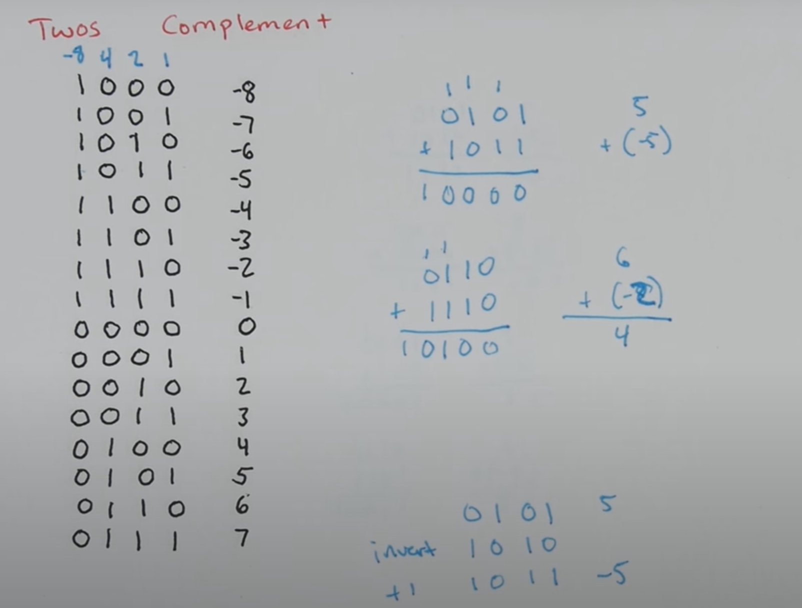

# 位运算
## 一补码、二补码
直接使用一位来做符号标志位，可能会存在以下问题：
1. 0会出现两次，即+0与-0
2. 相反数相加可能不为0

一补码（One's complement）
取补码作为它的负数，存在的问题：
1. 0会出现两次，即+0与-0
2. 相反数相加比真实结果结果少1（可以通过后续加一保持一致）

二补码（Two's complement）
取补码加1作为它的负数（解决一补码的第二条问题），同时也解决了第一个问题。对于n bit，它的最高位实际上代表了-2^n, 因此数的范围是（-2^n - 2^n - 1）
参考下面这张图

对于8bit的数字表示中，最小的数字是？
10000000