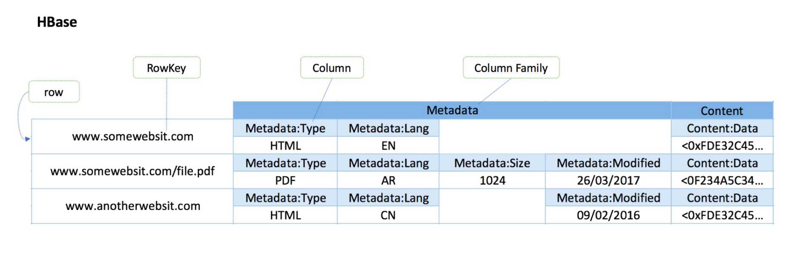

# Hbase
Only used as a note.
## Introduction
Apache HBase is an open-source version of Google's BigTable distributed storage system supported by the Apache Software Foundation. BigTable is a sparse, distributed, scalable, high-performance, versioned database.



A row in HBase is referenced using a rowkey which is a raw byte array, which can be considered to be the primary key of the table in an RDBMS. The primary key of the table has to be unique and hence is mapping to one and only one row. HBase automatically sorts table rows by rowkey when it stores them. By default, this sort is byte ordered.

Each column in HBase has a column name. Columns can be further grouped into column families. All columns belonging to the same column family share the same prefix. For example, in the figure above, the columns Metadata:Type and Metadata:Lang are both members of the Metadata column family, and the column Content:Data is a member of the Content column family. By default, the colon character : delimits the column prefix from the family member. The column family prefixes must be composed of printable characters. The qualifying tail can contain any arbitrary bytes. Note that although column families are fixed at table creation, column qualifiers are mutable and may differ between rows.

A cell is a combination of row, column family, and column qualifier, and at least one version(s). Each version has its own value and timestamp. Thus A {row, column_family:column, version} tuple exactly specifies a version of a cell in HBase. Similar to Rowkey, value is simply bytes, so any value that could be serialized into bytes can be stored in a cell. Rows in HBase are sorted lexicographically by rowkey which is a very important property as it allows for quick searching. You have learned the definition of lexicographical order in Project 1 and it will help you in this project. You may notice that the timestamp isn't explicitly noted in the above diagram. We are assuming that the sample table here has the attribute VERSIONS => '1'. The default value of VERSIONS given a column qualifier will be 1 if not explicitly set. Setting maximum-versions to 1 means each put still creates a new version but only the latest one is kept. In this case, a {row, column_family:column} tuple can be adequate to specify a value stored in HBase. However, you should understand the behavior of the HBase version dimension, which is vital to understanding the behaviors of the core HBase operations.
## Operations
HBase has four primary operations on the data model: Get, Put, Scan, and Delete.

A Get operation returns all of the cells for a specified row identified by a rowkey. You can further narrow the scope of what to Get by specifying column families, columns, timestamps, versions, and filters.

Scan is an operation that iterates over multiple rows for specific attributes based on some conditions. Similarly, you can limit the scope by specifying column families, columns, timestamps, versions, and filters. When using HBase Java APIs, if you try to limit the maximum number of values returned for each call to ResultScanner#next(), call Scan#setBatch(int).

Get and Scan operations always return data in sorted order. Data are first sorted by rowkeys, then by column family, then by column qualifier, and finally by timestamp (so the values with largest timestamps appear first).

A Put operation can either add new rows to the table when used with a new key or update a row if the key already exists. It always creates a new version of a cell at a certain timestamp. By default the system uses the server’s System#currentTimeMillis(), but you can specify the version (i.e. a long integer) yourself on a per-column level. This means it is possible to assign a time in the past or the future. To overwrite an existing value, do a put at the same row, column, and version to overwrite.

A Delete operation removes value(s) from a table in one of the following levels: a specified version of a column, all versions of a column, all columns of a column family, or the entire row. Note that HBase does not modify data in place. Delete will just create a new tombstone marker for the row to delete. These tombstones will be removed during compaction.

You need to understand all the core operations can manipulate different levels of data, not just by rows. Nevertheless, by default, Get and Scan operations on an HBase table are performed on data whose version has the largest timestamp. A Put operation always creates a new version of the data that are put into HBase and Delete operations delete an entire row.

## HBase Architecture
HBase is composed of three types of servers in a master/slave type of architecture. HRegionServer serves data for read and writes. When accessing data, clients directly communicate with HRegionServer. Region assignment, DDL(create, delete, etc) operations are handled by the HMaster. Zookeeper, which is a distributed coordination service, maintains a live cluster state. All HBase data is stored in HFiles. The basic architecture of HBase is shown below:


## Commands
Open up the HBase shell with the command hbase shell and create a table called songdata with a column family named data
```
hbase shell
> create 'songdata', 'data'
```
You can use describe 'songdata' to get the table metadata. After this, you may exit the HBase shell using exit.
```
hbase shell
> describe 'songdata'
```